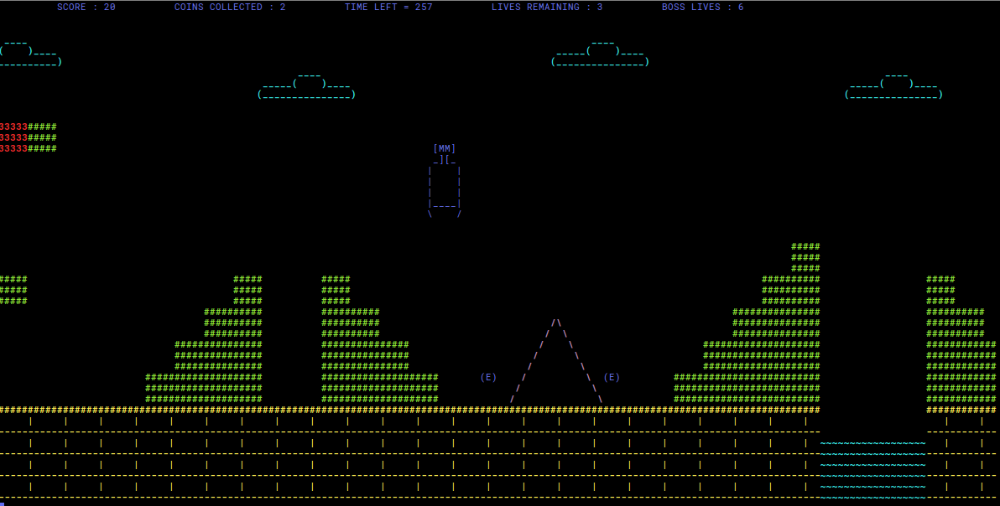
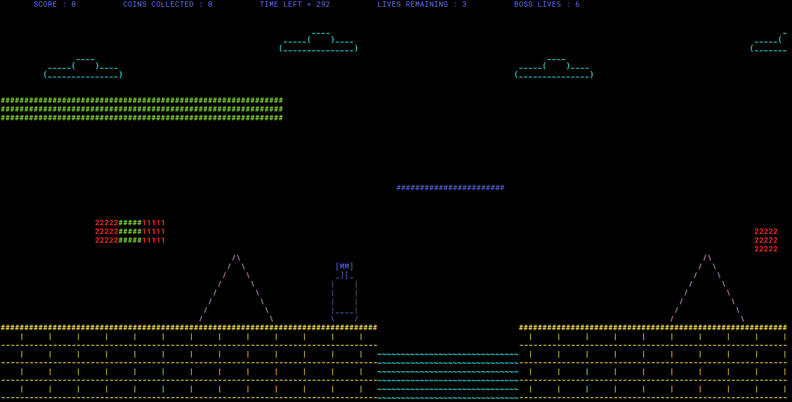

# Super Mario ( terminal-based version )

**Coded by** : *Preet Thakkar* 

**Language** : *Python3*

## About
Super Mario Bros is a platform video game developed and published by Nintendo. The successor to the 1983 arcade game, Mario Bros., it was released in Japan in 1985 for the Famicom, and in North America and Europe for the Nintendo Entertainment System (NES) in 1985 and 1987 respectively. 

This is a terminal version of the 'Super Mario Bros' game. It exhibits Object-Oriented Programming concepts like encapsulation, inheritance, abstraction and polymorphism.

## Pre-requisites

* The only requirement is [Python3](https://www.python.org/download/releases/3.0/)

## Installation (for Linux)

* **Python3** installation:
 
    ```console
    foo@bar:~$ sudo apt-get update
    foo@bar:~$ sudo apt-get install python3
    ```


## Instructions To Play 

* Run the following command to start the game.

    ```console
    foo@bar:~$ python3 run.py
    ```

* Use 'w', 'a', 's' and 'd' to control mario.

* Use 'space' to fire bullets.

## This Game

This game consists of one level. You will see that this game is quite a replica of the original game. You win when you defeat the **Boss enemy**. To do so, you need to have bullets which you get after crossing the checkpoint.
Rest of the details are stated below explicitly for each element of the game.

#### Mario

* Has 3 lives. If the case, Mario is respawned always at the beginning of the scnene (reason being the game has only one level).

* Has 300 seconds to complete the game.

* Can fire bullets after a certain checkpoint (power-up).

#### Scenary

* The background scenary keeps changing all the time. It contains clouds, mountains, pipes, pits, stairs etc.



#### Bricks

* The bricks may contain coins. One can distinguish by just seeing at the bricks. Some of them are breakable and some, not (as in the original game).


#### Coins/Gems

* Coins can be present on the way or **in the bricks**.

* The only gem you earn is when you cross the checkpoint(the bridge). Mario gets **bullets** to kill the Boss.

#### Enemies

* There are three types of enemies.

* The ordinary one:


* The Boss: appears at the end of the game.


* Smart Enemy: Chases Mario.

#### Spring

* There is a spring to jump over wide pits.

* 

#### Checkpoint

* It is a moving bridge which performs to and fro vertical motion. One can't move ahead in the game without using the bridge. 

* Also, after crossing the bridge, mario gets bullets.



#### Score

* The score increases when you collect coins or when you kill enemies.

* Final score is a function of coins collected, enemies killed and time left.